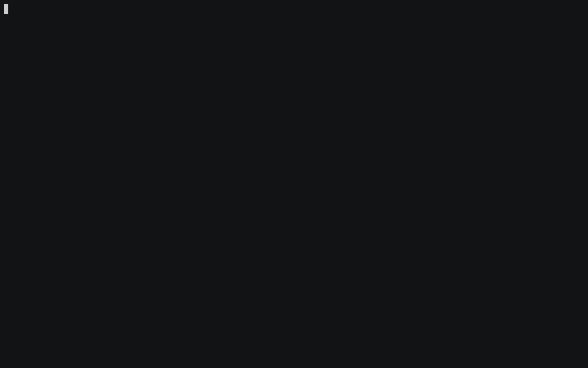

# Android Library Release Script

Release any Android library with this one simple trick DevOps won't tell you about.

## Prerequisites

```bash
brew install maven
brew install holgerbrandl/tap/kscript
brew install hub
```

Also, the project that you want to run the script on should have:

1. CHANGELOG.md
   - Version headings should start with `##`
2. gradle.properties
   - Should contain a `VERSION_NAME` property (e.g `VERSION_NAME=1.0.0`)
3. There should be an `uploadArchives` task in Gradle

## Usage

In order for the script to work, you have to run it inside the project you want to release.

```bash
$ kscript https://raw.githubusercontent.com/crunchyroll/android-library-release-script/master/src/main/kotlin/Release.kt --help

usage: [-h] [--dry-run] [--ticket TICKET] [--changelog CHANGELOG]
       [--tag-prefix TAG_PREFIX] [--no-tag-prefix]

optional arguments:
  -h, --help                show this help message and exit

  --dry-run                 Run the script with all actions disabled. Use this
                            to understand which actions would have been
                            executed.

  --ticket TICKET           Ticket number to use when creating the version
                            bump PR. Default is GUNDROID-88.

  --changelog CHANGELOG     Changelog file to modify

  --tag-prefix TAG_PREFIX   Version prefix to use for tag creation

  --no-tag-prefix           Do not add any prefix to the version tag
```



## Development

Run `./gradlew build` to compile the script and run all checks.

## Deployment

The script itself doesn't have to be deployed. Anyone can reference it directly from the `master` tree.
